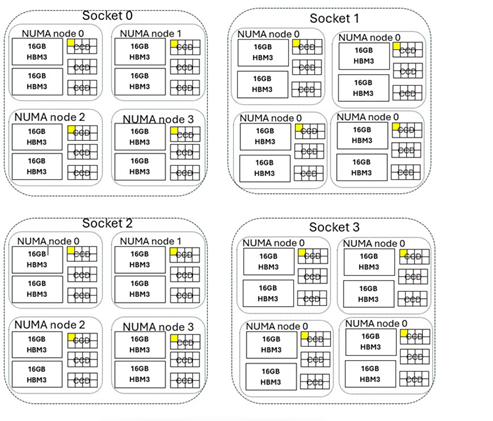

# HBv5-series virtual machine overview 

**Applies to:** :heavy_check_mark: Linux VMs :heavy_check_mark: Windows VMs :heavy_check_mark: Flexible scale sets :heavy_check_mark: Uniform scale sets

An [HBv5-series](./sizes/high-performance-compute/hbv5-series.md) server features 4 * 96-core AMD EPYC 9V33X CPUs for a total of 384 physical "Zen4" cores with Simultaneous Multithreading (SMT) disabled. These 384 cores are divided into 48 Core Chiplet Dies (CCDs) sections (12 per socket), and each CCD containing eight processor cores with uniform access to a 32 MB L3 cache. Azure HBv5 servers also run the following AMD BIOS settings: 

```bash
Nodes per Socket (NPS) = 4
L3 as NUMA = Disabled
Total NUMA domains within VM OS = 16 (2 per socket)
NUMA domains within VM OS = 4
C-states = Enabled
Determinism Mode = Power
```

As a result, the server boots with 16 NUMA domains (4 per socket) each 24-cores in size. Each NUMA has direct access two 16GB HBM3 modules.  

To provide room for the Azure hypervisor to operate without interfering with the VM, we reserve 4 physical cores per NUMA and 16 per server.

## VM topology

The following diagram shows the topology of the server. We reserve these 16 hypervisor host cores (yellow), taking the first core from specific Core Complex Dies (CCDs) in each NUMA domain, with the remaining cores for the HBv5-series VM (green).



The CCD boundary is different from a NUMA boundary. On HBv5, a group of six (6) consecutive CCDs is configured as a NUMA domain, both at the host server level and within a guest VM. Thus, all HBv5 VM sizes expose four uniform NUMA domains that appear to an OS and application as shown beneath, each with different number of cores depending on the specific [HBv5 VM size](./sizes/high-performance-compute/hbv5-series.md).

Each HBv5 VM size is similar in physical layout, features, and performance of a different CPU from the AMD EPYC 9V33X, as follows:

| HBv5-series VM size             | NUMA domains | Cores per NUMA domain  | 
|---------------------------------|--------------|------------------------|
Standard_HB368rs_v5               | 16           | 23                     | 
Standard_HB368-336rs_v5           | 16           | 21                     | 
Standard_HB368-288rs_v5           | 16           | 18                     | 
Standard_HB368-240rs_v5           | 16           | 15                     | 
Standard_HB368-192rs_v5           | 16           | 12                     | 
Standard_HB368-144rs_v5           | 16           | 9                      | 
Standard_HB368-96rs_v5            | 16           | 6                      |
Standard_HB368-48rs_v5            | 16           | 3                      |

> [!NOTE]
> * The constrained cores VM sizes only reduce the number of physical cores exposed to the VM. All global shared assets (RAM, memory bandwidth, L3 cache, GMI and xGMI connectivity, InfiniBand, Azure Ethernet network, local SSD) stay constant with the parent VM size. It allows the customer to pick a VM size best tailored to a given set of workload or software licensing needs.
> * Four CPU cores/CCD are needed to saturate memory bandwidth. This requirement means those Standard_HB368-144rs_v5, Standard_HB368-96rs_v5, and Standard_HB368-48rs_v5 VM sizes can't achieve full memory bandwidth of the server. 

The virtual NUMA mapping of each HBv5 VM size is mapped to the underlying physical NUMA topology. There's no potential misleading abstraction of the hardware topology. 

The exact topology for the various [HBv5 VM size](./sizes/high-performance-compute/hbv5-series.md) appears as follows using the output of [lstopo](https://linux.die.net/man/1/lstopo):

```bash
lstopo-no-graphics --no-io --no-legend --of txt
```
<br>
<details>
<summary>Select to view lstopo output for Standard_HB368rs_v5</summary>

:::image type="content" source="./media/hpc/architecture/hbv5/hbv5-368-lstopo.png" alt-text="Screenshot of lstopo output for HBv5-368 VM." lightbox="./media/hpc/architecture/hbv5/hbv5-368-lstopo.png":::
</details>

<details>
<summary>Select to view lstopo output for Standard_HB368-336rs_v5</summary>

:::image type="content" source="./media/hpc/architecture/hbv5/hbv5-336-lstopo.png" alt-text="Screenshot of lstopo output for HBv5-336 VM." lightbox="./media/hpc/architecture/hbv5/hbv5-336-lstopo.png":::
</details>

<details>
<summary>Select to view lstopo output for Standard_HB368-288rs_v5</summary>

:::image type="content" source="./media/hpc/architecture/hbv5/hbv5-288-lstopo.png" alt-text="Screenshot of lstopo output for HBv5-288 VM." lightbox="./media/hpc/architecture/hbv5/hbv5-288-lstopo.png":::
</details>

<details>
<summary>Select to view lstopo output for Standard_HB368-240rs_v5</summary>

:::image type="content" source="./media/hpc/architecture/hbv5/hbv5-240-lstopo.png" alt-text="Screenshot of lstopo output for HBv5-240 VM." lightbox="./media/hpc/architecture/hbv5/hbv5-240-lstopo.png":::
</details>

<details>
<summary>Select to view lstopo output for Standard_HB368-192rs_v5</summary>

:::image type="content" source="./media/hpc/architecture/hbv5/hbv5-192-lstopo.png" alt-text="Screenshot of lstopo output for HBv5-192 VM." lightbox="./media/hpc/architecture/hbv5/hbv5-192-lstopo.png":::
</details>

<details>
<summary>Select to view lstopo output for Standard_HB368-144rs_v5</summary>

:::image type="content" source="./media/hpc/architecture/hbv5/hbv5-144-lstopo.png" alt-text="Screenshot of lstopo output for HBv5-144 VM." lightbox="./media/hpc/architecture/hbv5/hbv5-144-lstopo.png":::
</details>

<details>
<summary>Select to view lstopo output for Standard_HB368-96rs_v5</summary>

:::image type="content" source="./media/hpc/architecture/hbv5/hbv5-96-lstopo.png" alt-text="Screenshot of lstopo output for HBv5-96 VM." lightbox="./media/hpc/architecture/hbv5/hbv5-96-lstopo.png":::
</details>

<details>
<summary>Select to view lstopo output for Standard_HB368-48rs_v5</summary>

:::image type="content" source="./media/hpc/architecture/hbv5/hbv5-48-lstopo.png" alt-text="Screenshot of lstopo output for HBv5-48 VM." lightbox="./media/hpc/architecture/hbv5/hbv5-48-lstopo.png":::
</details>

## InfiniBand networking
HBv5 VMs also feature 4 NVIDIA Quantum-2 CX7 InfiniBand (NDR) adapters each operating at up to 200 Gigabits/sec for a total of 800 Gigabits/sec per VM. One NIC connects to each of the 4 CPUs on each VM. The NIC is passed through to the VM via SRIOV, enabling network traffic to bypass the hypervisor. As a result, customers load standard Mellanox OFED drivers on HBv5 VMs as they would a bare metal environment.

HBv5 VMs support Adaptive Routing, Dynamic Connected Transport (DCT, in addition to the standard RC and UD transports), and hardware-based offload of MPI collectives to the onboard processor of the ConnectX-7 adapter. These features enhance application performance, scalability, and consistency, and usage of them is recommended.

## Best practices for InfiniBand configuration

*   Use a validated VM image. Choose an image with tested drivers and NDR InfiniBand-ready software:
    *   **Recommended**: AlmaLinux 8.10 from the AlmaLinux HPC shared image gallery  
        *The Azure HPC team provides access to AlmaLinux 8.10 from the AlmaLinux HPC shared image gallery, and this image is built using Azure HPC VM Image scripts.*
    *   **Also supported**: Azure HPC marketplace images (Ubuntu-HPC 18.04, Ubuntu-HPC 20.04)

*   Select the optimal InfiniBand transport protocol
    *   For *smaller-scale jobs*:
        ```bash
        UCX_TLS=rc,sm
        ```
    *   For *larger-scale jobs*:
        ```bash
        UCX_TLS=dc,sm UCX_MAX_RNDV_RAILS=1
        ```

*   Disable multi-rail for multi-node jobs
    ```bash
    export UCX_MAX_RNDV_RAILS=1
    ```

*   Use the latest stable versions
    *   UCX: **1.14.0 rc4** (as of September 2025)
    *   HPC-X MPI: **hpcx-v2.18-gcc-mlnx\_ofed-redhat8-cuda12-x86\_64** (as of September 2025)

## Best Practices for running MPI Jobs on HBv5

*   Apply the *hpc-compute* tuned profile, which is optimized for HPC workloads:
    ```bash
    sudo dnf install -y tuned
    sudo systemctl enable --now tuned
    sudo tuned-adm profile hpc-compute
    ```
*   Enable Transparent Huge Pages (THP) to improve memory efficiency for large allocations:
    ```bash
    echo madvise | sudo tee /sys/kernel/mm/transparent_hugepage/enabled
    echo madvise | sudo tee /sys/kernel/mm/transparent_hugepage/defrag
    ```
*   Enable NUMA balancing for better memory locality:
    ```bash
    echo 1 | sudo tee /proc/sys/kernel/numa_balancing
    ```
*   Drop caches before running jobs as this reduces variability and improves consistency:
    ```bash
    echo 3 | sudo tee /proc/sys/vm/drop_caches
    ```
*   Use HPCX MPI library on Azure HPC-optimized images:
    ```bash
    module load mpi/hpcx
    ```
*   MPI process placement and core affinity
    *   Pin MPI processes to physical cores
    *   Avoid oversubscription
    *   Use symmetric rank distribution per CCD (1–7 ranks per CCD)
        *   Each HBv5 VM has **48 CCDs**, so supported configurations include:  
            `48, 96, 144, 192, 288, 336 ranks per VM`
    *   Example command:
        ```bash
        mpirun -np <number_of_ranks> \
          --map-by ppr:<ranks_per_CCD>:l3cache \
          --rank-by slot \
          --bind-to core \
          <other_options> <executable> <arguments>
        ```
Optimal configuration depends on workload. Symmetric rank distribution usually performs best, but some workloads can benefit from using all 368 cores per VM. Benchmark multiple configurations to determine the best setting.  
*(Topology reference: 16 NUMA regions, 48 CCDs per VM.)*
:::image type="content" source="./media/hpc/architecture/hbv5/hbv5-336-lstopo.png" alt-text="Screenshot of HBv5-series VM Topology." lightbox="./media/hpc/architecture/hbv5/hbv5-336-lstopo.png":::

*   For multi VM jobs at scale, disable multi rail in UCX, using:
    ```bash
    export UCX_MAX_RNDV_RAILS=1
    ```

## Temporary storage
HBv5 VMs feature 9 physically local NVMe SSD devices. One device is preformatted to serve as a page file and appears in your VM as a generic *SSD* device. 8 other, larger SSDs are provided as unformatted block NVMe devices. 

As the block NVMe device bypasses the hypervisor, it has higher bandwidth, higher IOPS, and lower latency per IOP. When paired in a striped array, the NVMe SSD is expected to provide up to 50 GB/s of read bandwidth and 30 GB/s of write bandwidth for large block sizes. 

Combined, the 8 NVMe devices provide 15 TiB of total local storage per VM.

## Hardware specifications 

| Hardware specifications          | HBv5-series VMs                                     |
|----------------------------------|--------------------------------------------------   |
| Cores                            | 368, 336, 288, 240, 192, 144, 96, 48 (SMT disabled) | 
| CPU                              | AMD EPYC 9004-series (EPYC 9V64H)                   | 
| CPU Frequency (non-AVX)          | 3.5 GHz base, 4 GHz peak boost(FMAX)                | 
| Memory                           | 441 GB (RAM per core depends on VM size)            | 
| Local Disk                       | 8 * 1.8 TB NVMe (block), 480 GB SSD (page file)     | 
| InfiniBand                       | 4 * 200 Gb/s NVIDIA ConnectX-7 NDR InfiniBand       | 
| Network                          | 180 Gb/s Azure Accelerated Networking               | 


## Software specifications 

| Software specifications        | HBv5-series VMs                                            | 
|--------------------------------|-----------------------------------------------------------|
| Max MPI Job Size               | HPC-X (2.18 or higher)*, OpenMPI (4.1.3 or higher), MVAPICH2 (2.3.7 or higher), MPICH (4.1 or higher)  |
| MPI Support                    | HPC-X (2.13 or higher), Intel MPI (2021.7.0 or higher), OpenMPI (4.1.3 or higher), MVAPICH2 (2.3.7 or higher), MPICH (4.1 or higher)  |
| Additional Frameworks          | UCX, libfabric, PGAS, or other InfiniBand based runtimes                  |
| Azure Storage Support          | Standard and Premium Disks (maximum 32 disks), Azure NetApp Files, Azure Files, Azure HPC Cache, Azure Managed Lustre File System (Preview)             |
| Supported and Validated OS     | AlmaLinux 8.10, Red Hat Enterprise Linux 8.10, Ubuntu 22.04+ and 24.04            |
| Recommended OS for Performance | AlmaLinux HPC 8.10 (recommended image URN: almalinux:almalinux-hpc:8_10-hpc-gen2:latest), for scaling test, uses the URN recommended almalinux:almalinux-hpc:8_6-hpc-gen2:latest and the new HPC-X [tarball](https://github.com/Azure/azhpc-images/releases/tag/alma-hpc-20250529), Ubuntu-HPC 18.04+    |
| Orchestrator Support           | Azure CycleCloud, AKS; [cluster configuration options](sizes-hpc.md#cluster-configuration-options)                      | 

> [!NOTE]
> * These VMs support only Generation 2 VMs. 
> * All Red Hat Enterprise Linux (RHEL) versions earlier than 8.10, including derivatives such as CentOS and AlmaLinux, are deprecated.
> * Windows Server isn't supported on HBv5.

## Known Issues with IB RDMA and NUMA Node Affinity

### Issue Overview

On certain virtual machines (VMs), the InfiniBand RDMA device names (such as mlx5_[0-3]) may not align correctly with their respective NUMA node affinities. Ideally, each RDMA device should be mapped as follows:

-	mlx5_0 is on NUMA node: 0
-	mlx5_1 is on NUMA node: 4
-	mlx5_2 is on NUMA node: 8
-	mlx5_3 is on NUMA node: 12
  
However, an incorrect mapping example could be:

- mlx5_0 is on NUMA node: 4
- mlx5_1 is on NUMA node: 8
- mlx5_2 is on NUMA node: 12
- mlx5_3 is on NUMA node: 0
  
This misalignment can lead to performance degradation, particularly when running multimode MPI workloads.

### Verifying RDMA device to NUMA node mapping

To confirm whether your RDMA devices are correctly mapped to NUMA nodes, execute the following script:
```bash
for d in /sys/class/infiniband/*;
do
dev=$(basename "$d")
node=$(cat "$d/device/numa_node")
echo "$dev is on NUMA node: $node"
done
```
Compare the output with the ideal mapping listed above.

### Solution: Persistent device naming with Udev rules

To remediate the misalignment issue, follow these steps:
1.	Create a new file in /etc/udev/rules.d/, for example: 99-rdma-persistent-naming.rules
2.	Add the following lines to the file:
    ```bash
    ACTION=="add", SUBSYSTEMS=="pci", KERNELS=="0101:00:00.0", PROGRAM="rdma_rename %k NAME_FIXED mlx5_ib0"
    ACTION=="add", SUBSYSTEMS=="pci", KERNELS=="0102:00:00.0", PROGRAM="rdma_rename %k NAME_FIXED mlx5_ib1"
    ACTION=="add", SUBSYSTEMS=="pci", KERNELS=="0103:00:00.0", PROGRAM="rdma_rename %k NAME_FIXED mlx5_ib2"
    ACTION=="add", SUBSYSTEMS=="pci", KERNELS=="0104:00:00.0", PROGRAM="rdma_rename %k NAME_FIXED mlx5_ib3"
    ```
3.	Reload udev rules and trigger device events:
    ```bash
    # udevadm control --reload
    # udevadm trigger --type=devices --action=add
    ```
This solution ensures that RDMA device naming persists across VM reboots.

## Next steps

- Read about the latest announcements, HPC workload examples, and performance results at the [Azure Compute Tech Community Blogs](https://techcommunity.microsoft.com/t5/azure-compute/bg-p/AzureCompute).
- For a higher level architectural view of running HPC workloads, see [High Performance Computing (HPC) on Azure](/azure/architecture/topics/high-performance-computing/).
